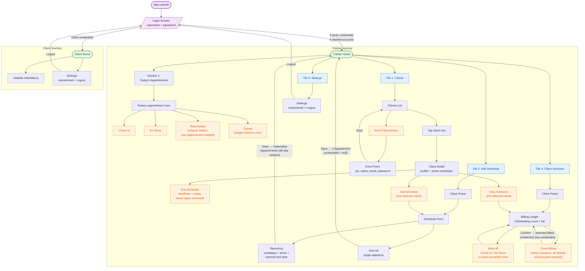

# User Journey — Simple Gym Buddy

End-to-end flow for Trainer and Client roles. Diagram is in **Mermaid**; paste into Lucidchart via *File → Import Diagram → Mermaid*, or view directly on GitHub / any Mermaid-aware viewer.

## Legend

- **Green** — Home screens (entry hubs after login).
- **Blue** — Tiles (sub-menu entry points on Trainer home).
- **Orange** — Actions the user can take.
- **Purple** — Entry/exit points (launch, login).

## Notes

- Trainer authentication uses 4 pre-seeded accounts; no trainer sign-up exists.
- Clients are created exclusively by the trainer via Clients → Enrol Client.
- Recurring schedules materialise Appointments into a rolling 60-day window; the same Appointment table feeds Today's Appointments and the Client Sessions ledger.
- Reschedule and Cancel on Today's Appointments affect a single instance — never the parent recurring Schedule.
- An entire recurring Schedule is ended from Client Detail (sets endDate = today, removes future scheduled Appointments, preserves past for billing history).
- Client Sessions is a per-client billing ledger: outstanding count = past `checked_in` + `no_show` sessions that haven't been included in a BillingClosure. Closing billing requires an amount paid. All outstanding sessions are selected by default; the trainer may unselect specific sessions to support partial payments (unselected sessions remain outstanding).
- Settings on both roles currently houses only Logout; reserved as the home for future settings.
